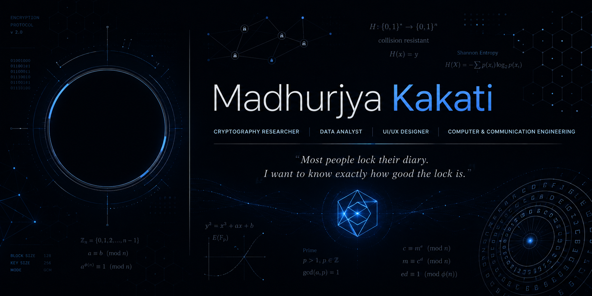

<!-- ============================================================
     MADHURJYA KAKATI — GitHub Profile README v3
     ============================================================ -->

 

# Hello, I'm Madhurjya

 

 

<i>"Most people lock their diary. I want to know exactly how good the lock is."</i>

  

 

 

<!-- ── ABOUT ──────────────────────────────────────────────────── -->

## About Me

I study how secrets are kept, and how they come apart. That habit of pulling structure out of what looks like noise runs through everything I work on.
  
Right now that means cryptographic protocol research, data analytics, and UI/UX design — often all in the same week.
  
Pre-final year B.Tech Computer &amp; Communication Engineering student at <strong>Manipal University Jaipur</strong>, based in Guwahati, Assam.
  
Actively looking for research collaborations and internship opportunities.

 

 

<!-- ── FEATURED RESEARCH ──────────────────────────────────────── -->

## Featured Research

 

<table border="0" cellpadding="0" cellspacing="0" width="720">
<tr>
<td align="left" style="padding: 2px;">

| | |
|---|---|
| **Project** | Custom Encryption Mechanism |
| **Type** | Independent Research |
| **Domain** | Applied Cryptography · Algorithm Design |
| **Language** | Python |

</td>
<td width="40"></td>
<td align="left" valign="top" style="padding: 2px;">

**Abstract**

Designed and implemented a custom encryption mechanism from scratch — tracing every design decision from primitive construction through key management to identified attack surfaces. The documentation deliberately includes failure modes and known weaknesses as primary research output.

</td>
</tr>
</table>

 

&nbsp;
&nbsp;
&nbsp;
&nbsp;

 

 

<!-- ── SKILLS ─────────────────────────────────────────────────── -->

## Skills

 

<!-- PROGRAMMING -->

  

  

<!-- RESEARCH & SECURITY -->

  

  

<!-- DATA -->

  

  

<!-- DESIGN -->

  

&nbsp;

 

 

<!-- ── CURRENT FOCUS ──────────────────────────────────────────── -->

## Current Focus

 

<table border="0" cellspacing="0" cellpadding="0">
<tr>
<td align="center" width="180" style="padding: 20px;">

  
Stress-testing cipher constructions
</td>
<td width="20"></td>
<td align="center" width="180" style="padding: 20px;">

  
Building a data visualization portfolio
</td>
<td width="20"></td>
<td align="center" width="180" style="padding: 20px;">

  
Publishing UI/UX work on Behance
</td>
<td width="20"></td>
<td align="center" width="180" style="padding: 20px;">

  
Studying modern cryptographic protocols
</td>
</tr>
</table>

 

 

<!-- ── CONNECT ────────────────────────────────────────────────── -->

## Connect

 

I'm always interested in conversations around cryptography, data analytics, 
security research, design systems, and open-source collaboration.

 

 

